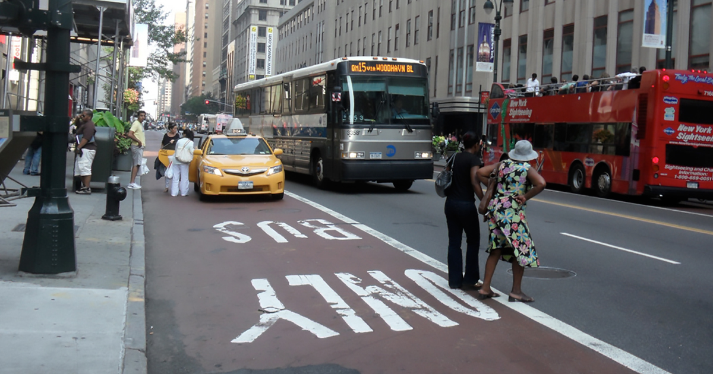

# YOLO v3 - Pedestrian Detection

### Directory structure

```
Pedestrian_vehicles/
├── experiments
│   ├── ...
│
├── YOLO_v3_Pytorch
│   ├── CHEME599_FINAL_GPU.ipynb
│   ├── config.py
│   ├── dataset.py
│   ├── loss.py
│   ├── model.py
│   ├── train.py
│   ├── utils.py
│   ├── PASCAL_VOC
│       ├── images
│       ├── labels
│       ├── ...
│       ├── test.csv
│       ├── train.csv
│       
├── Pedestrian_Detection_Poster.pdf
├── Pedestrian_Detection_Presentation.pdf
```

- `experiments`: Contains experimental files during learning. 
- `YOLO_v3_Pytorch`: Contains the pytorch files for YOLO v3. 
  - `CHEME599_FINAL_GPU.ipynb`: executable notbook to setup. 
  - `PASCAL_VOC`: dataset containing images and label. 

### Download Pascal VOC dataset
- Download the preprocessed dataset from [link](https://www.kaggle.com/aladdinpersson/pascal-voc-dataset-used-in-yolov3-video). Unzip this in the `YOLO_v3_Pytorch` directory.
- Or execute the CHEME599_FINAL_GPU notebook to get data directly from kaggle. 

### Download Caltech Pedestrian Detection dataset
- Download the Caltech Pedestrian Detection dataset from [link](http://www.vision.caltech.edu/Image_Datasets/CaltechPedestrians/)
- Or download the preprocessed data from [link](https://github.com/jennyrrrrr/caltech-pedestrian-dataset-to-yolo-format-converter)

### Training
- Edit the config.py file to match the setup you want to use. 
- Then follow the CHEME599_FINAL_GPU.ipynb to excute the code. 

### Example
input image:

output image:


### Result
- Results for this algorithm based on dataset of Pascal VOC are 
  - Class accuracy is: 38.888889%
  - No obj accuracy is: 6.138319%
  - Obj accuracy is: 72.682182%

### Reference
- Redmon et al., 2015, You Only Look Once: Unified real-time object detection
- Redmon et al., 2018, YOLOv3: An Incremental Improvement
- Sanna Perssonet al., 2018, YOLOv3 Implementation with Training setup from Scratch
- https://pjreddie.com/darknet/yolo/
